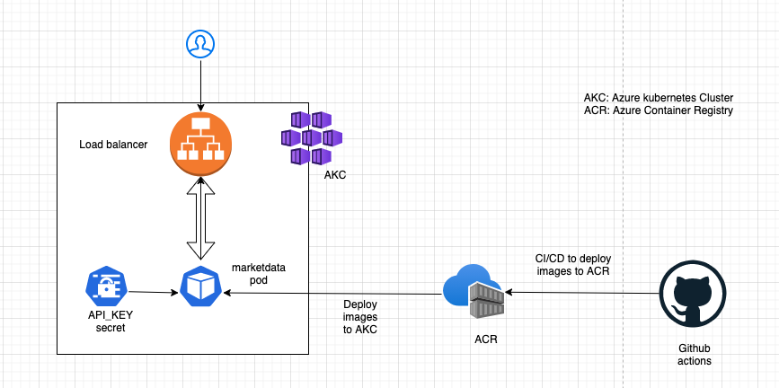

# Deploying applications to AKS

A sample project to demonstrate CI/CD deployment of a containerized application to Azure Kubernetes Service (AKS) via Azure container registry (ACR). \
We use Terraform to manage the infrastructure. \
<u>Terraform</u>: Terraform is a tool for building, changing, and versioning infrastructure safely and efficiently.

#### Azure Resources
<u>Storage Account</u>: Primarily used to store terraform state \
<u>Resource Group</u>: Logical grouping of a collection of Azure resources \
<u>Container Registry</u>: Build, store, and manage container images \
<u>Kubernetes Cluster</u>: Kubernetes on Azure

#### Terraform Resources
Terraform has a [registry](https://registry.terraform.io/) that provides plugins that implement the resource types required to maintain Azure infrastructure. \
In our case, we have already created a Storage Account and Resource Group. We create the container registry and kubernetes cluster: 
1. azurerm_container_registry: to create Azure container registry (ACR)
2. azurerm_kubernetes_cluster: to create Azure Kubernetes cluster (AKS)

#### CI/CD
Continuous integration and deployment has been implemented using Github actions however, one can use any CI/CD platform to achieve this. \

Azure has an [issue](https://github.com/Azure/AKS/issues/1517) where the service account cannot update the kubernetes cluster to access the registry via pipeline. \
`az aks update --name <K8s cluster name> 
         --resource-group <Resource Group name> 
         --attach-acr <Container registry name>` \
Follow the steps in the issue to add API permissions to service principle to fix this issue.

#### Deploying application manually
1. Build an image `mvn spring-boot:build-image`
2. Deploy resources to Azure via terraform  
   `az login` login to Azure with your credentials \
   `cd terraform` \
   `tf init` to initialize terraform \
   `tf plan` to identify any issues with terraform deployment
   `tf apply` to deploy your infrastructure to Azure
3. Deploy the image to Azure container registry 
   1. Login to ACR \
      `az acr login --name <Resource group name>`
   2. Fetch ACR login server name to be used to tag the image \
      `az acr list --resource-group <Resource group name> --query "[].{acrLoginServer:loginServer}" --output table`
   3. TAG image with ACR login server address \
      `docker tag marketdata:0.0.1-SNAPSHOT <ACR login name>/marketdata:latest`
   4. Push image to ACR \
    `docker push <ACR login name>/marketdata:latest`
4. Deploy the image from ACR to AKC \      
   1. Make sure AKC has access to ACR. If not, run the below command \
      `az aks update --name <K8s cluster name> --resource-group <Resource group name> --attach-acr <Container registry name>`
   2. Configure kubelet to talk to your cluster
      `az aks get-credentials --resource-group <Resource group name> --name <K8s cluster name>`
   3. Deploy from ACR to AKC using `kubectl`

#### Application
http://52.188.131.153/swagger-ui.html

